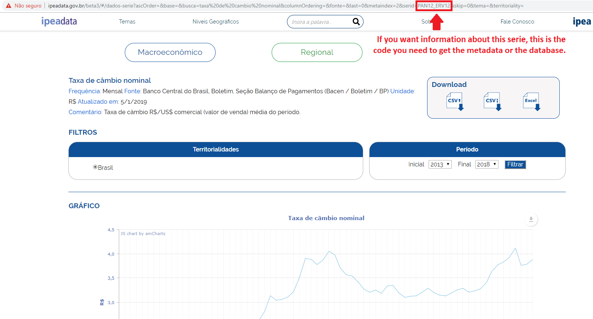

```{r echo = FALSE}
# knitr::opts_knit$set(root.dir = paste0(getwd(), '/vignettes'))
```

## Introduction

This R package is an easier alternative to use the data set of Brazilian Institute for Applied Economic Research (Ipea). It allows directly access to the macroeconomic, financial and regional databases. This package helps you to find the series you're looking for without the need to go on the [Ipeadata website](http://ipeadata.gov.br/) to find it and downloading it. This is a practical way to use the Ipea databases on R.

## How to install and load the ipeadatar R package

#### Via CRAN
```{r, eval = FALSE}
install.packages("ipeadatar")
library(ipeadatar)
```

#### Via Github
```{r, eval = FALSE}
library(devtools)
install_github("gomesleduardo/ipeadatar")
library(ipeadatar)
```

## Functions

|       Functions       |                     Outputs                    |
|-----------------------|------------------------------------------------|
| available_countries   |  List with available countries                 |
| available_series      |  List with available series                    |
| available_subjects    |  List with available subjects                  |
| available_territories |  List with available territorial divisions     |
| ipeadata              |  Returns a database about the requested series |
| metadata              |  Returns a metadata about the requested series |
| search_series         |  List with searched series                     |

## Examples
  
### 1. available_series
  
This function will show the available series in the Ipeadata site. One of the output variable of this function is the `code`. So, this is one way of getting the `code` for the the functions `metadata` and `ipeadata`.

```{r echo = FALSE, message = FALSE, warning = FALSE, eval = FALSE}
library(DT)
datatable(available_series(), caption = '', options = list(pageLength = 3))
```

<!-- Another way of getting this `code` is on the [Ipeadata website](http://ipeadata.gov.br/beta3/)^[This site is on the beta version yet.]. The `code` will be right next to the `serid=` on the URL current page. Just as the exemple below: -->

<!-- ```{r echo = FALSE, out.width = '100%'} -->
<!-- library(knitr) -->
<!--  -->
<!-- ``` -->

### 2. search_series

To simplify, this function will help you to find the series you've been searching for faster. Let's say that you are looking for databases about nominal exchange rate (or *taxa de câmbio nominal*, in Portuguese). All you have to do is to type a keyword on the parameter `terms`:
  
```{r echo = TRUE, eval = FALSE}
ipeadatar::search_series(terms = 'Taxa de câmbio nominal', fields = c('name'))
```

```{r echo = FALSE, eval = FALSE}
datatable(ipeadatar::search_series(terms = 'Taxa de câmbio nominal', fields = c('name')), caption = '', options = list(pageLength = 3))
```

Or maybe, you're looking for all active series:

```{r echo = TRUE, eval = FALSE, eval = FALSE}
ipeadatar::search_series(terms = 'Active', fields = c('status'))
```

```{r echo = FALSE, eval = FALSE}
datatable(ipeadatar::search_series(terms = 'Active', fields = c('status')), caption = '',             options = list(pageLength = 3))
```

### 3. metadata

Let's say you want information about IPCA (Broad Consumer Price Index -- official inflation index in Brazil) and you've found that the `code` of this series is `'PRECOS12_IPCA12'`. Therefore, that's how you get the metadata of this series:
  
```{r echo = TRUE, eval = FALSE}
metadata('PRECOS12_IPCA12')
```

```{r echo = FALSE, eval = TRUE, cache = TRUE, eval = FALSE}
suppressWarnings(suppressPackageStartupMessages(library(magrittr)))
suppressWarnings(suppressPackageStartupMessages(library(dplyr)))
suppressWarnings(suppressPackageStartupMessages(library(kableExtra)))

df_m <- 
  metadata('PRECOS12_IPCA12') %>% 
  select(code, name, comment, lastupdate, bname, source, sourcename)

kable(df_m, caption = '')
```

### 4. ipeadata

With the help of this function, we get the values of the IPCA. Its frequency is monthly. So, let's see with the help of the following graphic:

```{r echo = FALSE, cache = TRUE, fig.align = 'center', fig.width = 7.5, fig.height = 3.75, eval = FALSE}
ipeadata('PRECOS12_IPCA12')
```

```{r out.width = '60%', echo = FALSE, cache = TRUE, fig.align = 'center', eval = FALSE}
df <- ts(ipeadata('PRECOS12_IPCA12')$value, start = c(1979, 12), freq = 12)

library(dygraphs)

dygraph(df) %>%
dyOptions(stackedGraph = TRUE) %>%
dyRangeSelector(height = 20) %>% 
dySeries("V1", label = "IPCA") %>% 
dyOptions(fillGraph = TRUE, fillAlpha = 0.4, colors = "blue")
```

Now, you search for information about the homicide rate (per 100.000 inhabitants) in Brazilian states from 1995 to 2010. This is what you should do:

```{r eval = FALSE, cache = TRUE, eval = FALSE}
homic_rate1995 <- 
ipeadata("THOMIC") %>% 
filter(uname == "States" & date == "1995-01-01")

homic_rate2000 <- 
ipeadata("THOMIC") %>% 
filter(uname == "States" & date == "2000-01-01")

homic_rate2005 <- 
ipeadata("THOMIC") %>% 
filter(uname == "States" & date == "2005-01-01")

homic_rate2010 <- 
ipeadata("THOMIC") %>% 
filter(uname == "States" & date == "2010-01-01")
```

Let's see a graphic with this information:

```{r message = FALSE, warning = FALSE, include = FALSE, paged.print = FALSE, cache = TRUE, eval = FALSE}
library(spdep)
library(rgdal)
library(leaflet)
library(RColorBrewer)
library(mapview)

# Import shapefile (Brazil map - States) ----

shp <-  readOGR("br_unidades_da_federacao", "BRUFE250GC_SIR", stringsAsFactors = FALSE, encoding = "UTF-8")

# Import dataset ----

homic_rate1995 <- 
  ipeadata("THOMIC") %>% 
  filter(uname == "States" & date == "1995-01-01")

homic_rate2000 <- 
  ipeadata("THOMIC") %>% 
  filter(uname == "States" & date == "2000-01-01")

homic_rate2005 <- 
  ipeadata("THOMIC") %>% 
  filter(uname == "States" & date == "2005-01-01")

homic_rate2010 <- 
  ipeadata("THOMIC") %>% 
  filter(uname == "States" & date == "2010-01-01")

# Import IBGE codes and add to dataset ----

ibge <- read.csv2("cod.csv")
homic_rate1995 <- merge(homic_rate1995, ibge, by.x = "tcode", by.y = "Código.UF")
homic_rate2000 <- merge(homic_rate2000, ibge, by.x = "tcode", by.y = "Código.UF")
homic_rate2005 <- merge(homic_rate2005, ibge, by.x = "tcode", by.y = "Código.UF")
homic_rate2010 <- merge(homic_rate2010, ibge, by.x = "tcode", by.y = "Código.UF")

# Merge dataset and shapefile ----

shp_homic_rate1995 <- merge(shp, homic_rate1995, by.x = "CD_GEOCUF", by.y = "tcode")
shp_homic_rate2000 <- merge(shp, homic_rate2000, by.x = "CD_GEOCUF", by.y = "tcode")
shp_homic_rate2005 <- merge(shp, homic_rate2005, by.x = "CD_GEOCUF", by.y = "tcode")
shp_homic_rate2010 <- merge(shp, homic_rate2010, by.x = "CD_GEOCUF", by.y = "tcode")

shp_homic_rate1995$value <- round(shp_homic_rate1995$value, 2)
shp_homic_rate2000$value <- round(shp_homic_rate2000$value, 2)
shp_homic_rate2005$value <- round(shp_homic_rate2005$value, 2)
shp_homic_rate2010$value <- round(shp_homic_rate2010$value, 2)

# Transform data ----

# add geographical coordinates
proj4string(shp_homic_rate1995) <- CRS("+proj=longlat +datum=WGS84 +no_defs")
proj4string(shp_homic_rate2000) <- CRS("+proj=longlat +datum=WGS84 +no_defs")
proj4string(shp_homic_rate2005) <- CRS("+proj=longlat +datum=WGS84 +no_defs")
proj4string(shp_homic_rate2010) <- CRS("+proj=longlat +datum=WGS84 +no_defs")

Encoding(shp_homic_rate1995$NM_ESTADO) <- "UTF-8"
Encoding(shp_homic_rate2000$NM_ESTADO) <- "UTF-8"
Encoding(shp_homic_rate2005$NM_ESTADO) <- "UTF-8"
Encoding(shp_homic_rate2010$NM_ESTADO) <- "UTF-8"

.simpleCap <- function(x) {
  s <- strsplit(x, " ")[[1]]
  x <- paste(toupper(substring(s, 1, 1)), tolower(substring(s, 2)),
             sep = "", collapse = " ")
  s <- strsplit(x, " ")[[1]]
  s <- ifelse(nchar(s) > 2, s, tolower(s))
  paste(s, sep = "", collapse = " ")
}

# Edit States names
shp_homic_rate1995$NM_ESTADO <- sapply(shp_homic_rate1995$NM_ESTADO, .simpleCap,  USE.NAMES = FALSE) 
shp_homic_rate2000$NM_ESTADO <- sapply(shp_homic_rate2000$NM_ESTADO, .simpleCap,  USE.NAMES = FALSE) 
shp_homic_rate2005$NM_ESTADO <- sapply(shp_homic_rate2005$NM_ESTADO, .simpleCap,  USE.NAMES = FALSE) 
shp_homic_rate2010$NM_ESTADO <- sapply(shp_homic_rate2010$NM_ESTADO, .simpleCap,  USE.NAMES = FALSE) 

# replace NA
shp_homic_rate1995$value[is.na(shp_homic_rate1995$value)] <- 0 
shp_homic_rate2000$value[is.na(shp_homic_rate2000$value)] <- 0 
shp_homic_rate2005$value[is.na(shp_homic_rate2005$value)] <- 0 
shp_homic_rate2010$value[is.na(shp_homic_rate2010$value)] <- 0 
``` 

```{r echo = FALSE, fig.width = 8, cache = TRUE, eval = FALSE}

# Generate map ----

pal <- colorBin(brewer.pal(n = 7, name = "Reds"), domain = c(0, 70), n = 7) # Map colors

state_popup1995 <- paste0("<strong>State: </strong>", 
                          paste0(shp_homic_rate1995$NM_ESTADO, " (", shp_homic_rate1995$UF,")"), 
                          "<br><strong>Homicide rate: </strong>", 
                          shp_homic_rate1995$value)

state_popup2000 <- paste0("<strong>State: </strong>", 
                          paste0(shp_homic_rate2000$NM_ESTADO, " (", shp_homic_rate2000$UF,")"), 
                          "<br><strong>Homicide rate: </strong>", 
                          shp_homic_rate2000$value)

state_popup2005 <- paste0("<strong>State: </strong>", 
                          paste0(shp_homic_rate2005$NM_ESTADO, " (", shp_homic_rate2005$UF,")"), 
                          "<br><strong>Homicide rate: </strong>", 
                          shp_homic_rate2005$value)

state_popup2010 <- paste0("<strong>State: </strong>", 
                          paste0(shp_homic_rate2010$NM_ESTADO, " (", shp_homic_rate2010$UF,")"), 
                          "<br><strong>Homicide rate: </strong>", 
                          shp_homic_rate2010$value)

graph1995 <- 
  leaflet(data = shp_homic_rate1995) %>%
  addProviderTiles("CartoDB.Positron") %>%
  addPolygons(fillColor = ~pal(shp_homic_rate1995$value), 
              fillOpacity = 0.8, 
              color = "#BDBDC3", 
              weight = 1, 
              popup = state_popup1995) %>%
  addLegend("bottomleft", pal = pal, values = ~shp_homic_rate1995$value,
            title = "Homicide rate (1995)",
            opacity = 1)

graph2000 <- 
  leaflet(data = shp_homic_rate2000) %>%
  addProviderTiles("CartoDB.Positron") %>%
  addPolygons(fillColor = ~pal(shp_homic_rate2000$value), 
              fillOpacity = 0.8, 
              color = "#BDBDC3", 
              weight = 1, 
              popup = state_popup2000) %>%
  addLegend("bottomleft", pal = pal, values = ~shp_homic_rate2000$value,
            title = "Homicide rate (2000)",
            opacity = 1)

graph2005 <- 
  leaflet(data = shp_homic_rate2005) %>%
  addProviderTiles("CartoDB.Positron") %>%
  addPolygons(fillColor = ~pal(shp_homic_rate2005$value), 
              fillOpacity = 0.8, 
              color = "#BDBDC3", 
              weight = 1, 
              popup = state_popup2005) %>%
  addLegend("bottomleft", pal = pal, values = ~shp_homic_rate2005$value,
            title = "Homicide rate (2005)",
            opacity = 1)

graph2010 <- 
  leaflet(data = shp_homic_rate2010) %>%
  addProviderTiles("CartoDB.Positron") %>%
  addPolygons(fillColor = ~pal(shp_homic_rate2010$value), 
              fillOpacity = 0.8, 
              color = "#BDBDC3", 
              weight = 1, 
              popup = state_popup2010) %>%
  addLegend("bottomleft", pal = pal, values = ~shp_homic_rate2010$value,
            title = "Homicide rate (2010)",
            opacity = 1)

latticeView(graph1995, graph2000, graph2005, graph2010, ncol = 2, sync = "all", sync.cursor = TRUE)
```

Finally, you looking for the evolution of the average years of schooling for people 25 years of age or older in Brazilian Mesoregions between the 90's and 00's:
  
```{r eval = FALSE, cache = TRUE, eval = FALSE}
avg_yschol1991 <-
  ipeadata("MEDUCA") %>%
  filter(uname == "Mesoregions" & date == "1991-01-01")

avg_yschol2000 <-
  ipeadata("MEDUCA") %>%
  filter(uname == "Mesoregions" & date == "2000-01-01")
```

```{r message = FALSE, warning = FALSE, include = FALSE, paged.print = FALSE, cache = TRUE, eval = FALSE}
# Import shapefile (Brazil map - Municipalities) ----

shp1 <-  readOGR("br_mesorregioes", "BRMEE250GC_SIR", stringsAsFactors = FALSE, encoding = "UTF-8")

# Import dataset ----

avg_yschol1991 <-
  ipeadata("MEDUCA") %>%
  filter(uname == "Mesoregions" & date == "1991-01-01")

avg_yschol2000 <-
  ipeadata("MEDUCA") %>%
  filter(uname == "Mesoregions" & date == "2000-01-01")

# Import IBGE codes and add to dataset ----

ibge1 <- read.csv2("cod_meso.csv")
avg_yschol1991 <- merge(avg_yschol1991, ibge1, by.x = "tcode", by.y = "Código.Meso")
avg_yschol2000 <- merge(avg_yschol2000, ibge1, by.x = "tcode", by.y = "Código.Meso")

# Merge dataset and shapefile ----

shp_avg_yschol1991 <- merge(shp1, avg_yschol1991, by.x = "CD_GEOCME", by.y = "tcode")
shp_avg_yschol2000 <- merge(shp1, avg_yschol2000, by.x = "CD_GEOCME", by.y = "tcode")

shp_avg_yschol1991$value <- round(shp_avg_yschol1991$value, 2)
shp_avg_yschol2000$value <- round(shp_avg_yschol2000$value, 2)

# Transform data ----

# add geographical coordinates

proj4string(shp_avg_yschol1991) <- CRS("+proj=longlat +datum=WGS84 +no_defs")
proj4string(shp_avg_yschol2000) <- CRS("+proj=longlat +datum=WGS84 +no_defs")

Encoding(shp_avg_yschol1991$NM_MESO) <- "UTF-8"
Encoding(shp_avg_yschol2000$NM_MESO) <- "UTF-8"

# Edit Mesoregions names

.simpleCap <- function(x) {
  s <- strsplit(x, " ")[[1]]
  x <- paste(toupper(substring(s, 1, 1)), tolower(substring(s, 2)),
             sep = "", collapse = " ")
  s <- strsplit(x, " ")[[1]]
  s <- ifelse(nchar(s) > 2, s, tolower(s))
  paste(s, sep = "", collapse = " ")
}

shp_avg_yschol1991$NM_MESO <- sapply(shp_avg_yschol1991$NM_MESO, .simpleCap,  USE.NAMES = FALSE) 
shp_avg_yschol2000$NM_MESO <- sapply(shp_avg_yschol2000$NM_MESO, .simpleCap,  USE.NAMES = FALSE) 

# replace NA

shp_avg_yschol1991$value[is.na(shp_avg_yschol1991$value)] <- 0
shp_avg_yschol2000$value[is.na(shp_avg_yschol2000$value)] <- 0
```

```{r echo = FALSE, fig.width = 8, cache = TRUE, eval = FALSE}
# Generate map ----

pal1 <- colorBin(brewer.pal(n = 8, name = "RdYlGn"), domain = c(1, 9), n = 9) # Map colors

meso_popup1991 <- paste0("<strong>Mesoregion: </strong>", 
                         paste0(shp_avg_yschol1991$NM_MESO, " (", shp_avg_yschol1991$UF,")"), 
                         "<br><strong>Average years: </strong>", 
                         shp_avg_yschol1991$value)

meso_popup2000 <- paste0("<strong>Mesoregion: </strong>", 
                         paste0(shp_avg_yschol1991$NM_MESO, " (", shp_avg_yschol1991$UF,")"), 
                         "<br><strong>Average years: </strong>", 
                         shp_avg_yschol2000$value)

graph11991 <- 
  leaflet(data = shp_avg_yschol1991) %>%
  addProviderTiles("CartoDB.Positron") %>%
  addPolygons(fillColor = ~pal1(shp_avg_yschol1991$value), 
              fillOpacity = 0.8, 
              color = "#BDBDC3", 
              weight = 1, 
              popup = meso_popup1991) %>%
  addLegend("bottomleft", pal = pal1, values = ~shp_avg_yschol1991$value,
            title = "Schooling (1991)",
            opacity = 1)

graph12000 <- 
  leaflet(data = shp_avg_yschol2000) %>%
  addProviderTiles("CartoDB.Positron") %>%
  addPolygons(fillColor = ~pal1(shp_avg_yschol2000$value), 
              fillOpacity = 0.8, 
              color = "#BDBDC3", 
              weight = 1, 
              popup = meso_popup2000) %>%
  addLegend("bottomleft", pal = pal1, values = ~shp_avg_yschol2000$value,
            title = "Schooling (2000)",
            opacity = 1)

latticeView(graph11991, graph12000, ncol = 2, sync = "all", sync.cursor = TRUE)
```

